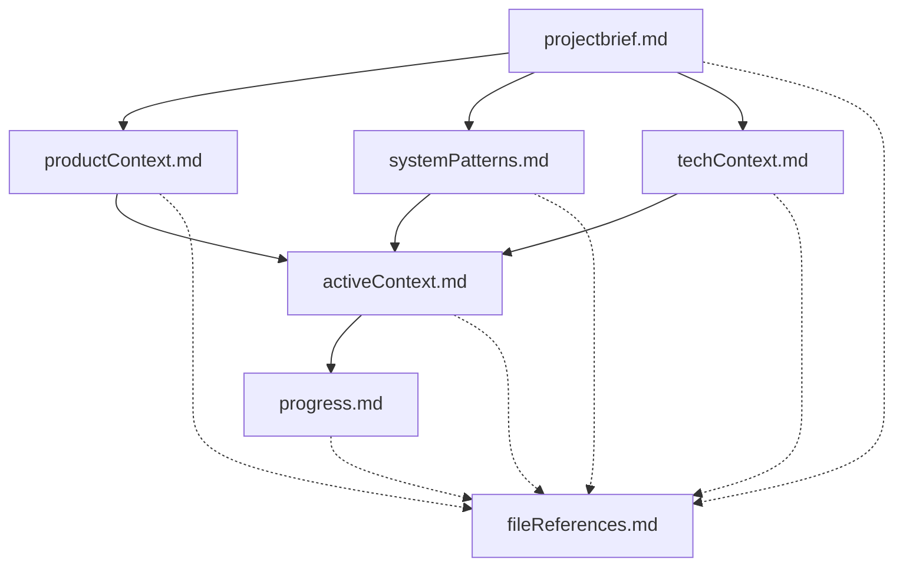

# Memory Bank System

## Overview

The Memory Bank System is a comprehensive documentation approach designed to maintain perfect project continuity across different sessions. It creates a structured knowledge repository that serves as the single source of truth for all project information.

## Core Principles

- **Complete Documentation**: All project knowledge must be documented in the Memory Bank
- **Hierarchical Structure**: Files build upon each other in a clear hierarchy
- **Regular Updates**: Documentation is updated after significant changes or discoveries
- **Comprehensive Reviews**: All Memory Bank files must be reviewed at the start of each task

## Memory Bank Structure

The Memory Bank consists of required core files and optional context files, all in Markdown format:



### Core Files (Required)

#### 1. `projectbrief.md`

- Foundation document that shapes all other files
- Created at project start
- Defines core requirements and goals
- Source of truth for project scope

**Template:**

```markdown
# Project Brief: [Project Name]

## Purpose
[Brief description of why this project exists]

## Core Requirements
- [Requirement 1]
- [Requirement 2]
- [Requirement 3]

## Success Criteria
- [Criterion 1]
- [Criterion 2]

## Constraints
- [Constraint 1]
- [Constraint 2]

## Stakeholders
- [Stakeholder 1]: [Role/Responsibility]
- [Stakeholder 2]: [Role/Responsibility]
```

#### 2. `productContext.md`

- Why this project exists
- Problems it solves
- How it should work
- User experience goals

**Template:**

```markdown
# Product Context: [Project Name]

## Problem Statement
[Detailed description of the problem(s) this product solves]

## Target Users
- [User type 1]: [Needs and expectations]
- [User type 2]: [Needs and expectations]

## User Experience Goals
- [Goal 1]
- [Goal 2]

## Key Features
- [Feature 1]: [Purpose and value]
- [Feature 2]: [Purpose and value]

## User Flows
1. [Flow 1]
2. [Flow 2]
```

#### 3. `activeContext.md`

- Current work focus
- Recent changes
- Next steps
- Active decisions and considerations

**Template:**

```markdown
# Active Context: [Project Name]

## Current Focus
[Description of what's currently being worked on]

## Recent Changes
- [Change 1]: [Date] - [Description]
- [Change 2]: [Date] - [Description]

## Next Steps
1. [Step 1]
2. [Step 2]
3. [Step 3]

## Active Decisions
- [Decision 1]: [Status] - [Context]
- [Decision 2]: [Status] - [Context]

## Open Questions
- [Question 1]
- [Question 2]
```

#### 4. `systemPatterns.md`

- System architecture
- Key technical decisions
- Design patterns in use
- Component relationships

**Template:**

```markdown
# System Patterns: [Project Name]

## Architecture Overview
[High-level description of the system architecture]

## Key Components
- [Component 1]: [Purpose and responsibilities]
- [Component 2]: [Purpose and responsibilities]

## Design Patterns
- [Pattern 1]: [Where/how it's used]
- [Pattern 2]: [Where/how it's used]

## Data Flow
[Description of how data flows through the system]

## Technical Decisions
- [Decision 1]: [Rationale]
- [Decision 2]: [Rationale]
```

#### 5. `techContext.md`

- Technologies used
- Development setup
- Technical constraints
- Dependencies

**Template:**

```markdown
# Technical Context: [Project Name]

## Technology Stack
- Frontend: [Technologies]
- Backend: [Technologies]
- Database: [Technologies]
- Infrastructure: [Technologies]

## Development Environment
- [Tool/Setup 1]: [Configuration details]
- [Tool/Setup 2]: [Configuration details]

## Dependencies
- [Dependency 1]: [Version] - [Purpose]
- [Dependency 2]: [Version] - [Purpose]

## Technical Constraints
- [Constraint 1]
- [Constraint 2]

## Build & Deployment
[Description of build and deployment processes]
```

#### 6. `progress.md`

- What works
- What's left to build
- Current status
- Known issues

**Template:**

```markdown
# Progress: [Project Name]

## Completed Features
- [Feature 1]: [Completion date] - [Notes]
- [Feature 2]: [Completion date] - [Notes]

## In Progress
- [Feature 3]: [Status] - [Expected completion]
- [Feature 4]: [Status] - [Expected completion]

## Backlog
- [Feature 5]
- [Feature 6]

## Known Issues
- [Issue 1]: [Severity] - [Workaround if any]
- [Issue 2]: [Severity] - [Workaround if any]
```

### Additional Context Files

Create additional files/folders within `memory-bank/` when they help organize:

- Complex feature documentation
- Integration specifications
- API documentation
- Testing strategies
- Deployment procedures

## Workflows

### Starting a New Task

1. Read ALL Memory Bank files
2. Verify context is complete and up-to-date
3. Develop strategy based on documentation
4. Present approach before implementation

### Completing a Task

1. Update relevant Memory Bank files
2. Document changes made
3. Update project rules if needed
4. Clarify next steps

## Documentation Updates

Memory Bank updates should occur when:

1. Discovering new project patterns
2. After implementing significant changes
3. When context needs clarification
4. At regular intervals (e.g., end of work session)

### Update Process

1. Review ALL Memory Bank files
2. Document current state accurately
3. Clarify next steps
4. Update project rules as needed

## Project Rules File

The project rules file (`.projectrules`) captures important patterns, preferences, and project intelligence that help work more effectively. It should document:

- Critical implementation paths
- User preferences and workflow
- Project-specific patterns
- Known challenges
- Evolution of project decisions
- Tool usage patterns
- Styling preferences (e.g., font choices, formatting standards)

### Documenting User Preferences

It's particularly important to document user preferences that might differ from defaults or common practices. For example:

- Font preferences (e.g., Arial vs. Times New Roman)
- Formatting standards
- Tool preferences
- Workflow patterns

These preferences should be clearly documented and reflected in both the project rules file and relevant technical documentation.

**Template:**

```markdown
# Project Rules: [Project Name]

## Code Style
- [Rule 1]
- [Rule 2]

## Workflow Preferences
- [Preference 1]
- [Preference 2]

## Implementation Patterns
- [Pattern 1]: [Context and usage]
- [Pattern 2]: [Context and usage]

## Known Challenges
- [Challenge 1]: [Approach]
- [Challenge 2]: [Approach]

## Tool Usage
- [Tool 1]: [How it's used in this project]
- [Tool 2]: [How it's used in this project]
```

## Implementation Guide

To implement this Memory Bank System in your project:

1. Create a `memory-bank/` directory in your project root
2. Initialize the core files using the templates provided
3. Establish a routine for updating the Memory Bank
4. Review all Memory Bank files at the start of each work session
5. Maintain the `.projectrules` file as a living document
6. Add file references to each Memory Bank document to link to implementation files
7. Keep the `fileReferences.md` index updated when adding or modifying files

Remember: The effectiveness of this system depends entirely on the accuracy and completeness of the documentation. Invest time in maintaining these files to ensure project continuity.

## Cross-Referencing System

The Memory Bank includes a cross-referencing system that links documentation to implementation files:

1. **File References Sections**: Each Memory Bank file includes a "File References" section that lists the relevant LaTeX files it describes.
2. **fileReferences.md Index**: A comprehensive index that maps all LaTeX files to their corresponding Memory Bank documentation.
3. **Bidirectional Navigation**: Allows navigation from documentation to implementation and vice versa.

### Cross-Reference Maintenance

When adding or modifying files:

1. Update the "File References" section in relevant Memory Bank files
2. Update the `fileReferences.md` index with the new file and its documentation references
3. Ensure all links are valid and point to existing files

This cross-referencing system ensures that all project documentation is properly linked to the implementation files, making it easier to navigate between documentation and code.
